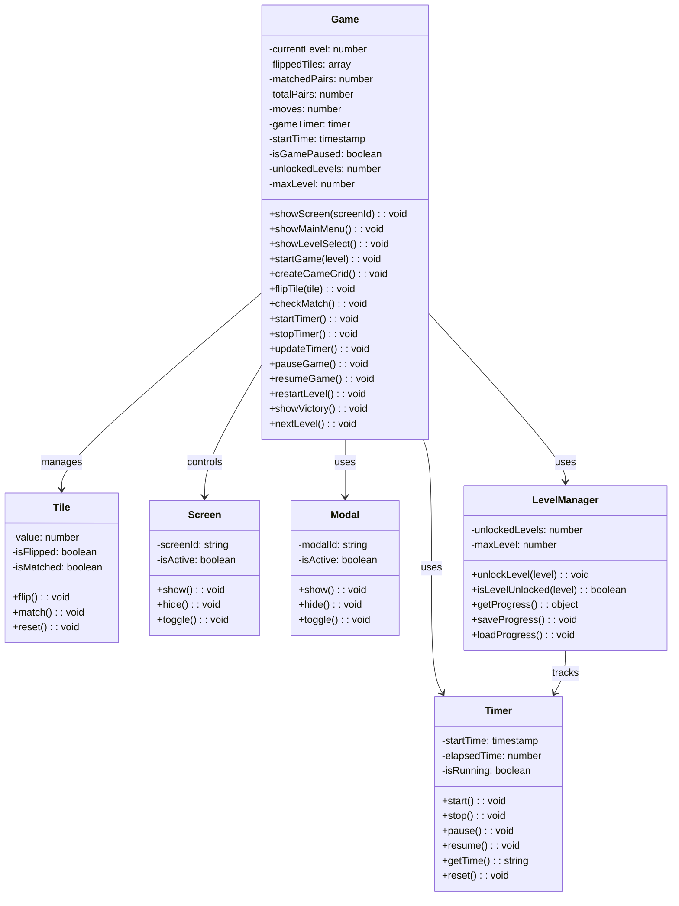
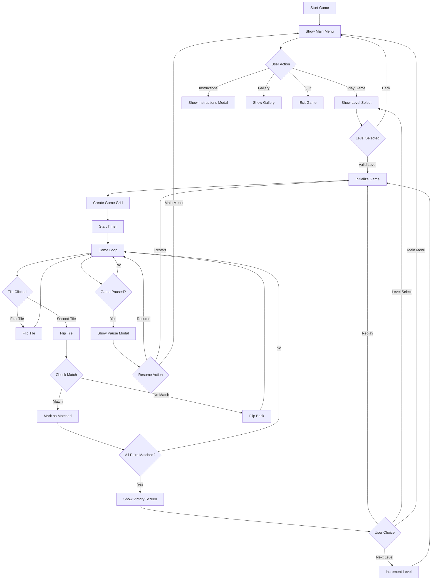
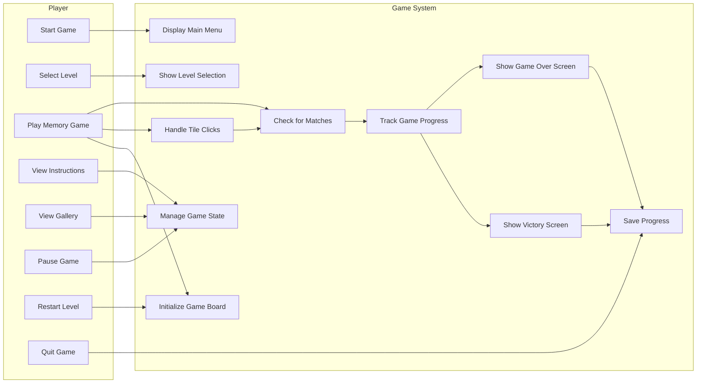
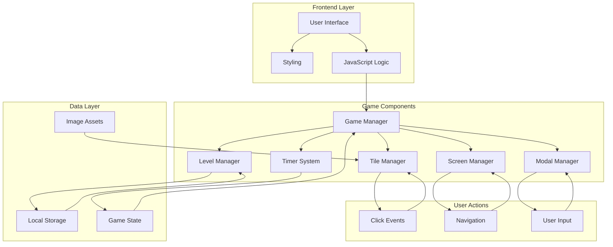

# Sachi's Pookies - Technical Documentation

## UML Class Diagram

## Activity Diagram - Game Flow

## Use Case Diagram

## Design Diagram - System Architecture

## System Components Description

### 1. Game Manager (Core Controller)
- **Purpose**: Central game logic coordinator
- **Responsibilities**: 
  - Game state management
  - Screen transitions
  - Level progression
  - Victory/Game Over conditions

### 2. Tile Manager
- **Purpose**: Manages individual game tiles
- **Responsibilities**:
  - Tile flip animations
  - Match detection
  - Tile state tracking
  - Image loading and display

### 3. Screen Manager
- **Purpose**: Handles different game screens
- **Responsibilities**:
  - Main menu display
  - Level selection
  - Game board rendering
  - Victory/Game Over screens

### 4. Modal Manager
- **Purpose**: Controls popup modals
- **Responsibilities**:
  - Instructions display
  - Pause menu
  - Confirmation dialogs
  - Settings panels

### 5. Level Manager
- **Purpose**: Manages game progression
- **Responsibilities**:
  - Level unlocking
  - Progress tracking
  - Local storage management
  - Difficulty scaling

### 6. Timer System
- **Purpose**: Game timing and scoring
- **Responsibilities**:
  - Elapsed time tracking
  - Move counting
  - Performance metrics
  - High score management

## Data Flow

1. **Game Initialization**: Level Manager → Screen Manager → Game Manager
2. **Tile Interaction**: User → Tile Manager → Game Manager → Screen Manager
3. **Progress Saving**: Game Manager → Level Manager → Local Storage
4. **Screen Transitions**: User → Screen Manager → UI Updates
5. **Modal Interactions**: User → Modal Manager → Game Manager

## Security Considerations

- Local storage data is validated before use
- Image paths are sanitized
- User input is handled through controlled UI elements
- No external API calls or data transmission

## Performance Optimizations

- Efficient DOM manipulation with minimal reflows
- Image preloading for smooth gameplay
- Optimized animations using CSS transforms
- Responsive design for various screen sizes
- Lazy loading of game assets